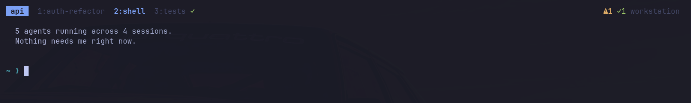
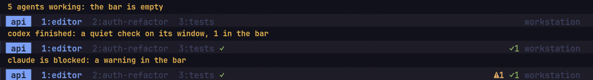
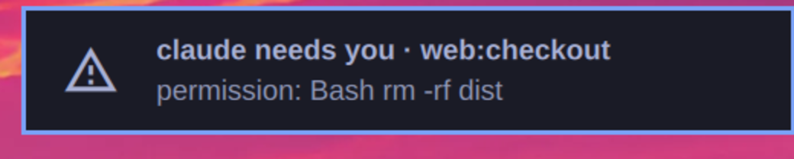
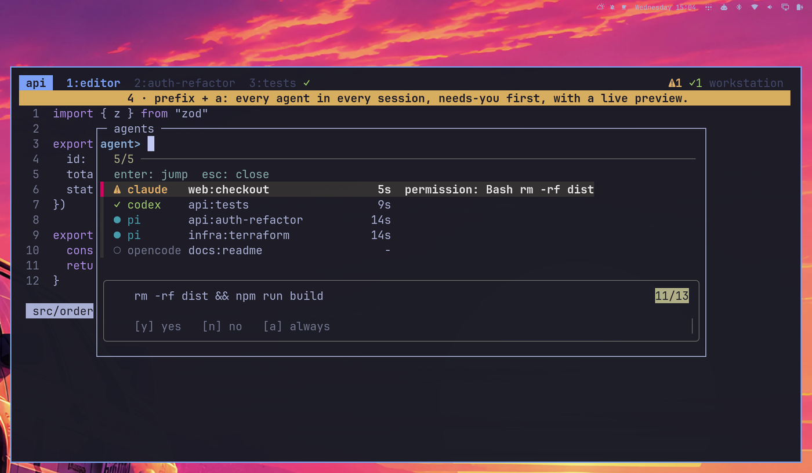
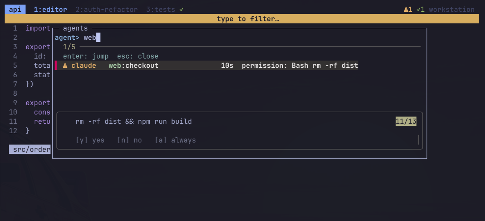
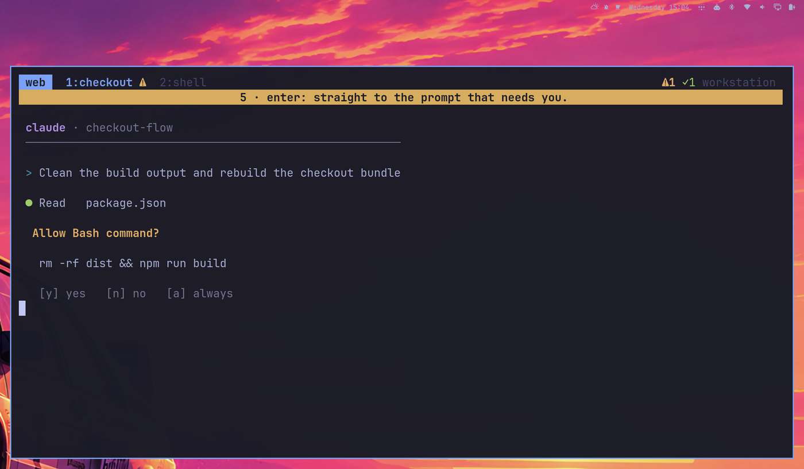
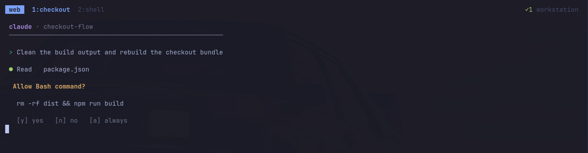

# tmux-agent-status

[](https://github.com/gs/tmux-agent-status/actions/workflows/ci.yml)
[](LICENSE)
[](#requirements)

**Quiet status for the coding agents running in your tmux panes**: Claude Code, Codex, opencode and pi.
Nothing is shown while agents work. When one needs you, you get a small marker, an optional
desktop toast, and a searchable list to jump straight to it.

<p align="center">
  
</p>

<sub>Real terminal, real tmux, real desktop toast; only the agents are stand-ins. The yellow line is a caption added for the demo.</sub>

## What you see

Three states, and only two of them ever show up. Working is deliberately invisible.

| state | meaning | bar / window marker | desktop toast |
|---|---|---|---|
| working | agent busy | nothing | never |
| waiting | blocked on a permission or a question | `⚠N` / `⚠` | yes, unless you're already looking at it |
| done | finished, you haven't looked yet | `✓N` / `✓` | off by default |

### 1. Silent until something needs you

The bar at three moments: five agents working (nothing shown), `codex` finishing (a quiet `✓`), and
`claude` blocking on a permission prompt in another session (`⚠`). The `✓` clears the moment you
focus that pane, with nothing to dismiss.



### 2. When an agent needs you

The warning appears in the bar (top right of the screenshot above) and, unless you're already looking at that pane, a desktop toast
(Omarchy's notification server, or plain `notify-send`) lands at the top of the screen. Clicking it
jumps to the pane and raises the terminal window.



### 3. `prefix a` (or `prefix A`): search and jump

A popup lists every agent in every session: needs-you first, then done, then working, then agents
that haven't reported yet (`○`, found by process name). The preview shows the selected pane's
latest output, here the exact command it is asking permission for.



Type to filter by agent, session or window. Enter jumps.



### 4. Land right on the prompt

Enter switches session, window and pane and, on Hyprland, raises the terminal.



Answer it and the warning clears itself (and its toast is dismissed). The finished agent's `✓` waits
for you.



## Requirements

| need | why | notes |
|---|---|---|
| **tmux ≥ 3.2** | `display-popup`, array hooks | required |
| **bash ≥ 4.2** | associative arrays | required. macOS ships 3.2: `brew install bash` |
| **git** | clone / TPM | to install |
| **procps** (`ps`) | knows when an agent has really exited | required in practice; without it the plugin falls back to the foreground command name, which is less reliable for wrapper scripts |
| **coreutils, sed, awk, util-linux** (`readlink -f`, `sort`, `timeout`, `flock`) | ordinary plumbing | present on any normal Linux; `flock` is optional |
| **fzf** | the searchable popup | optional. Without it `prefix a` opens a plain numbered tmux menu |
| **jq** | `install.sh` editing your agents' JSON configs | needed to run `install.sh`; the hooks themselves work without it |
| **notify-send** (`libnotify`) or **Omarchy** | desktop toasts | optional. Without either there are simply no toasts |
| **Hyprland** (`hyprctl`) | raise the terminal window after a toast click | optional |

Debian/Ubuntu: `sudo apt install tmux git jq fzf libnotify-bin` (the rest is normally preinstalled).
Arch: `sudo pacman -S tmux git jq fzf libnotify`.

Linux is what it's developed and tested on. macOS should work for the bar, markers and list with a newer
bash, but it is untested and has no toasts. The pi and opencode adapters run inside those agents' own
runtimes (Node), so they need nothing extra.

## Install

**TPM:** `set -g @plugin 'gs/tmux-agent-status'`. **Without TPM**, add to `tmux.conf`, *after* your
status-bar options:

```tmux
run-shell ~/code/tmux-agent-status/agent-status.tmux
```

The plugin prepends `#{@agent_summary}` to `status-right` and appends a marker to the window formats.
Set `@agent-status-modify-status off` / `@agent-status-modify-window-format off` to place
`#{@agent_summary}` / `#{@agent_mark}` yourself.

Then connect the agents (each step is optional, idempotent and reversible with `--uninstall`):

```sh
./install.sh all            # or: claude | codex | opencode | pi
```

| agent | how it reports | notes |
|---|---|---|
| Claude Code | hooks in `~/.claude/settings.json` (existing hooks are kept) | working / waiting / done |
| Codex | hooks in `~/.codex/hooks.json` | approve the new hooks once with `/hooks` |
| opencode | plugin symlinked into `~/.config/opencode/plugin/` | sub-agent sessions are ignored |
| pi | extension symlinked into `~/.pi/agent/extensions/` | working / done only (pi has no permission prompts) |

Verified so far: **pi** (live), **Claude Code** (live: a real `claude -p` run goes working → done → cleared;
the permission `waiting` path is covered by payload-shape tests, not a live prompt). **Codex** and
**opencode** adapters are written against their documented events but **not yet run live**: please
report what you see.

Agents that were already running when you installed keep running without reporting: restart them
(in pi, `/reload`). They still appear in the list as `○` because they are found by process name.

## Keys

| key | action |
|---|---|
| `prefix a` / `prefix A` | searchable agent list, enter jumps (`Esc` closes); a plain menu if fzf isn't installed |
| `@agent-status-key-next` (unbound by default) | one key: jump to the oldest agent that needs you |

## Notifications

- One toast when an agent starts **waiting**; none if you're looking at that pane; repeats within
  10 s are dropped. `done` toasts are off unless you enable them.
- Uses `omarchy-notification-send` if present (glyph, click-to-jump), else `notify-send`, else nothing.
- `waiting` toasts are **critical**, so they stay until dismissed. They are dismissed automatically
  when the agent resumes or exits. Set `urgency-waiting` to `normal` if you want them to expire.
- **Do Not Disturb wins.** With DND on (Omarchy: the muted bell in the bar), toasts are silenced by
  the notification server. The bar, markers and list still work. For a banner that DND doesn't touch,
  use `set -g @agent-status-tmux-message on`: a message on the status line of every client.

## Options

`set -g @agent-status-<name> <value>`

| option | default | |
|---|---|---|
| `key-pick` | `a A` | keys for the popup; `""` to skip |
| `key-next` | none | key for jump-to-oldest-waiting |
| `agents` | `pi claude codex opencode` | process names listed before they report |
| `notify` | `on` | master switch for toasts |
| `notify-done` | `off` | also toast when an agent finishes |
| `notify-done-min-secs` | `0` | only if the run took at least this long |
| `debounce` | `10` | min seconds between toasts per pane |
| `tmux-message` | `off` | also show a banner on the tmux status line |
| `urgency-waiting` / `urgency-done` | `critical` / `normal` | Omarchy toast urgency |
| `glyph-waiting` / `glyph-done` | `󰀪` / `󰄬` | Omarchy toast glyphs |
| `icon-waiting` / `icon-done` | `⚠` / `✓` | bar and window markers |
| `color-waiting` / `color-done` | `yellow` / `green` | |
| `modify-status` / `modify-window-format` | `on` | let the plugin edit `status-right` / window formats |

`AGENT_STATUS_NOTIFY_CMD=/path/to/cmd` replaces the notifier entirely (called as `cmd TITLE BODY`).

## How it works

Agents push their state through hooks: `agent-status set working|waiting|done`. The state is one small
file per pane in `$XDG_RUNTIME_DIR/agent-status-$UID/`. Every change recomputes two tmux options,
`@agent_summary` and `@agent_mark`, so the bar updates instantly and nothing polls.

- Records of closed panes, or panes with no process left except a shell, are dropped automatically
  (decided from the pane's process tree, so wrappers like `sh -c "agent; …"` are fine).
- A `done` that arrives while you are watching that pane is never recorded.
- Everything is a silent no-op outside tmux, and hooks never fail or slow the agent.

```
agent-status set <working|waiting|done> [--agent NAME] [--msg TEXT]
agent-status clear | seen [PANE] | refresh | list
agent-status pick [CLIENT]                 # the fzf popup
agent-status jump next [CLIENT] [PANE]     # oldest agent that needs you
agent-status jump pane PANE [CLIENT]       # what a toast click runs
```

## Privacy and safety

Everything is local: no network, no telemetry. State is a few bytes per pane in your runtime directory
(`$XDG_RUNTIME_DIR`, mode 700; the `/tmp` fallback is only used if it is owned by you). Agent-supplied
text (messages, names) is stripped of control characters and `#` is escaped before it reaches tmux.
`install.sh` edits `~/.claude/settings.json` and `~/.codex/hooks.json` (backed up next to them as
`*.bak.tmux-agent-status`) and only ever adds or removes its own entries.

## Development

```sh
tests/run.sh          # runs against a private tmux server with the notifier stubbed
shellcheck -x -S warning bin/agent-status adapters/hook.sh agent-status.tmux install.sh
```

CI ([status](https://github.com/gs/tmux-agent-status/actions)) runs both on every push.

## License

Public domain ([Unlicense](LICENSE)). Copy it, change it, sell it, no attribution needed.
