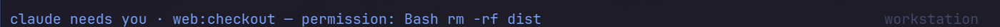

# tmux-agent-status

[](https://github.com/gs/tmux-agent-status/actions/workflows/ci.yml)
[](LICENSE)
[](#requirements)

**The anti-dashboard for AI coding agents in tmux.** No sidebar, no live feed of prompts and tool
calls, no desktop notifications, no daemon. For Claude Code, Codex, opencode and pi: nothing is
shown while an agent works. When one needs you — blocked on a permission, or just finished — you
get a small marker in the bar, plus a searchable popup to jump straight to it. **It lives entirely
inside tmux.**

<p align="center">
  
</p>

## What you see

Three states, and only two of them ever show up. Working is deliberately invisible.

| state | meaning | bar / window marker | banner (optional) |
|---|---|---|---|
| working | agent busy | nothing | never |
| waiting | blocked on a permission or a question | `⚠N` / `⚠` | yes, unless you're already looking at it |
| done | finished, you haven't looked yet | `✓N` / `✓` | never |

### 1. Silent until something needs you

The bar at three moments: five agents working (nothing shown), `codex` finishing (a quiet `✓`), and
`claude` blocking on a permission prompt in another session (`⚠`). The `✓` clears the moment you
focus that pane, with nothing to dismiss.


### 2. When an agent needs you

The `⚠` stays in the bar until you deal with it. If you want a nudge as well, turn on the banner
(`set -g @agent-status-banner on`): for a few seconds the status line of every attached client shows
which agent is blocked and where. It never shows if you're already looking at that pane, and never
twice within 10 seconds for the same one.



### 3. `prefix a` (or `prefix A`): search and jump

A popup lists every agent in every session: needs-you first, then done, then working, then agents
that haven't reported yet (`○`, found by process name). The preview shows the selected pane's
latest output, here the exact command it is asking permission for.


Type to filter by agent, session or window. Enter jumps.


### 4. Land right on the prompt

Enter switches session, window and pane.


Answer it and the warning clears itself. The finished agent's `✓` waits for you.


## Requirements

| need | why | notes |
|---|---|---|
| **tmux ≥ 3.2** | `display-popup`, array hooks | required |
| **bash ≥ 4.2** | associative arrays | required. macOS ships 3.2: `brew install bash` |
| **git** | clone / TPM | to install |
| **procps** (`ps`) | knows when an agent has really exited | required in practice; without it the plugin falls back to the foreground command name, which is less reliable for wrapper scripts |
| **coreutils, sed, awk, util-linux** (`readlink -f`, `sort`, `flock`) | ordinary plumbing | present on any normal Linux; `flock` is optional |
| **fzf** | the searchable popup | optional. Without it `prefix a` opens a plain numbered tmux menu |
| **jq** | `install.sh` editing your agents' JSON configs | needed to run `install.sh`; the hooks themselves work without it |

Debian/Ubuntu: `sudo apt install tmux git jq fzf` (the rest is normally preinstalled).
Arch: `sudo pacman -S tmux git jq fzf`.

Linux is what it's developed and tested on. Nothing here is desktop-specific, so macOS should work with a
newer bash, but it is untested. The pi and opencode adapters run inside those agents' own
runtimes (Node), so they need nothing extra.

## Install

**Quick start (TPM):** needs [TPM](https://github.com/tmux-plugins/tpm) installed first.

```tmux
# ~/.tmux.conf
set -g @plugin 'gs/tmux-agent-status'
```

```sh
tmux source ~/.tmux.conf   # then press prefix + I to fetch the plugin
~/.tmux/plugins/tmux-agent-status/install.sh all   # wire up every installed agent
```

That's it — two commands, no binary to download, no config to hand-edit. `install.sh all` is
idempotent and safe to re-run; add `--uninstall` to undo it.

**Without TPM**, add to `tmux.conf`, *after* your status-bar options (use the path you cloned this
repo into):

```tmux
run-shell /path/to/tmux-agent-status/agent-status.tmux
```

The plugin prepends `#{@agent_summary}` to `status-right` and appends a marker to the window formats.
Set `@agent-status-modify-status off` / `@agent-status-modify-window-format off` to place
`#{@agent_summary}` / `#{@agent_mark}` yourself.

Then connect the agents — this is the same step the TPM quick start above already ran for you via
`install.sh all`; run it yourself if you installed without TPM, or to wire up individual agents (each
step is optional, idempotent and reversible with `--uninstall`):

```sh
./install.sh all            # or: claude | codex | opencode | pi
```

| agent | how it reports | notes |
|---|---|---|
| Claude Code | hooks in `~/.claude/settings.json` (existing hooks are kept) | working / waiting / done |
| Codex | hooks in `~/.codex/hooks.json` | approve the new hooks once with `/hooks` |
| opencode | installer detects V1/V2 and links the matching plugin to its discovery directory | sub-agent sessions are ignored |
| pi | extension symlinked into `~/.pi/agent/extensions/` | working / done only (pi has no permission prompts) |

Verified so far: **pi** (live), **Claude Code** (live: a real `claude -p` run goes working → done → cleared;
the permission `waiting` path is covered by payload-shape tests, not a live prompt). **Codex** and
**opencode** adapters are written against their documented events but **not yet run live**: please
report what you see.

Agents that were already running when you installed keep running without reporting: restart them
(in pi, `/reload`). They still appear in the list as `○` because they are found by process name.

## Keys

| key | action |
|---|---|
| `prefix a` / `prefix A` | searchable agent list, enter jumps (`Esc` closes); a plain menu if fzf isn't installed |
| `@agent-status-key-next` (unbound by default) | one key: jump to the oldest agent that needs you |

## Banner (optional, off by default)

A short message on the status line when an agent starts **waiting** (not when it finishes). It is the
only "notification" the plugin has, and it stays inside tmux: nothing is sent to your desktop, so it
also works over SSH and on machines with no notification daemon.

- Skipped when you're looking at that pane; repeats for the same pane within `debounce` seconds are dropped.
- Enable: `set -g @agent-status-banner on`. Length: `@agent-status-banner-ms` (default 5000).

## Options

`set -g @agent-status-<name> <value>`

| option | default | |
|---|---|---|
| `key-pick` | `a A` | keys for the popup; `""` to skip |
| `key-next` | none | key for jump-to-oldest-waiting |
| `agents` | `pi claude codex opencode` | process names listed before they report |
| `banner` | `off` | status-line banner when an agent starts waiting |
| `banner-ms` | `5000` | how long the banner stays |
| `debounce` | `10` | min seconds between banners per pane |
| `icon-waiting` / `icon-done` | `⚠` / `✓` | bar and window markers |
| `color-waiting` / `color-done` | `yellow` / `green` | |
| `modify-status` / `modify-window-format` | `on` | let the plugin edit `status-right` / window formats |

## How it works

Agents push their state through hooks: `agent-status set working|waiting|done`. The state is one small
file per pane in `$XDG_RUNTIME_DIR/agent-status-$UID/`. Every change recomputes two tmux options,
`@agent_summary` and `@agent_mark`, so the bar updates instantly and nothing polls.

- Records of closed panes, or panes with no process left except a shell, are dropped automatically
  (decided from the pane's process tree, so wrappers like `sh -c "agent; …"` are fine).
- A `done` that arrives while you are watching that pane is never recorded.
- Everything is a silent no-op outside tmux, and hooks never fail or slow the agent.

```
agent-status set <working|waiting|done> [--agent NAME] [--msg TEXT]
agent-status clear | seen [PANE] | refresh | list
agent-status pick [CLIENT]                 # the fzf popup
agent-status jump next [CLIENT] [PANE]     # oldest agent that needs you
agent-status jump pane PANE [CLIENT]       # used by the fzf-less menu
agent-status open | menu [CLIENT]          # what the key runs / the plain tmux menu
```

## Privacy and safety

Everything is local: no network, no telemetry. State is a few bytes per pane in your runtime directory
(`$XDG_RUNTIME_DIR`, mode 700; the `/tmp` fallback is only used if it is owned by you). Agent-supplied
text (messages, names) is stripped of control characters and `#` is escaped before it reaches tmux.
`install.sh` edits `~/.claude/settings.json` and `~/.codex/hooks.json` (backed up next to them as
`*.bak.tmux-agent-status`) and only ever adds or removes its own entries.

## Development

```sh
tests/run.sh          # runs against a private tmux server
shellcheck -x -S warning bin/agent-status adapters/hook.sh agent-status.tmux install.sh
```

CI ([status](https://github.com/gs/tmux-agent-status/actions)) runs both on every push.

## License

[MIT](LICENSE). Copy it, change it, sell it — just keep the copyright notice.
