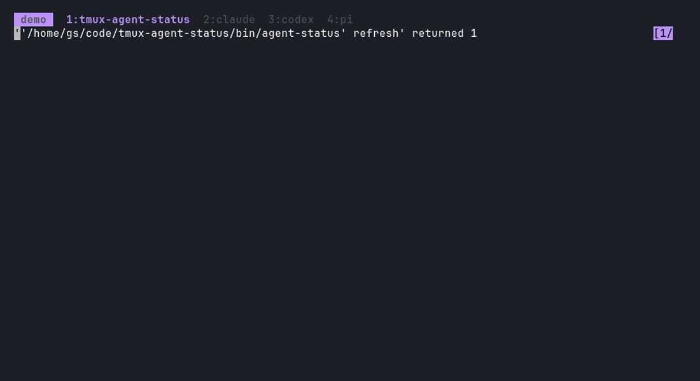
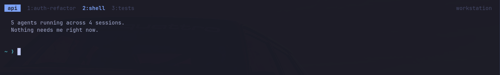
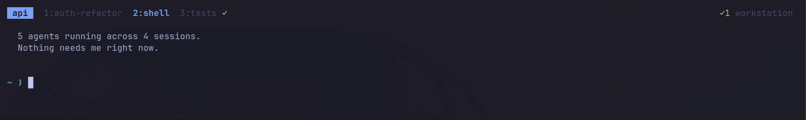

# tmux-agent-status

**Quiet status for the coding agents running in your tmux panes**: Claude Code, Codex, opencode and pi.
Nothing is shown while agents work. When one needs you, you get a small marker, an optional
desktop toast, and a searchable list to jump straight to it.

<p align="center">
  
</p>

<sub>Real recording of the plugin (fake agents, isolated tmux). Full-quality video: [docs/img/demo.mp4](docs/img/demo.mp4).</sub>

## What you see

Three states, and only two of them ever show up. Working is deliberately invisible.

| state | meaning | bar / window marker | desktop toast |
|---|---|---|---|
| working | agent busy | nothing | never |
| waiting | blocked on a permission or a question | `⚠N` / `⚠` | yes, unless you're already looking at it |
| done | finished, you haven't looked yet | `✓N` / `✓` | off by default |

### 1. Quiet by default

Five agents are running and the bar is empty. No noise until something needs you.



### 2. A finished agent leaves a quiet check mark

`3:tests` finished. The `✓` marks the window and the bar counts it. It disappears the moment
you focus that pane, with nothing to dismiss.



### 3. An agent needs you

`claude` is blocked on a permission prompt in another session. The bar shows `⚠1`, and if you were
looking at that window the marker would sit right next to it.


You also get a desktop toast (Omarchy's notification server, or plain `notify-send`). Clicking it
jumps to the pane and raises the terminal window.


### 4. `prefix a` (or `prefix A`): search and jump

A popup lists every agent in every session: needs-you first, then done, then working, then agents
that haven't reported yet (`○`, found by process name). A live preview of the selected pane is below.


Type to filter by agent, session or window. Enter jumps.


### 5. Land right on the prompt

Enter switches session, window and pane and, on Hyprland, raises the terminal.


Answer it and the warning clears itself (and its toast is dismissed). The finished agent's `✓`
is still waiting for you.


## Install

**TPM:** `set -g @plugin 'you/tmux-agent-status'`. **Without TPM**, add to `tmux.conf`, *after* your
status-bar options:

```tmux
run-shell ~/code/tmux-agent-status/agent-status.tmux
```

The plugin prepends `#{@agent_summary}` to `status-right` and appends a marker to the window formats.
Set `@agent-status-modify-status off` / `@agent-status-modify-window-format off` to place
`#{@agent_summary}` / `#{@agent_mark}` yourself.

Then connect the agents (each step is optional, idempotent and reversible with `--uninstall`):

```sh
./install.sh all            # or: claude | codex | opencode | pi
```

| agent | how it reports | notes |
|---|---|---|
| Claude Code | hooks in `~/.claude/settings.json` (existing hooks are kept) | working / waiting / done |
| Codex | hooks in `~/.codex/hooks.json` | approve the new hooks once with `/hooks` |
| opencode | plugin symlinked into `~/.config/opencode/plugin/` | sub-agent sessions are ignored |
| pi | extension symlinked into `~/.pi/agent/extensions/` | working / done only (pi has no permission prompts) |

Agents that were already running when you installed keep running without reporting: restart them
(in pi, `/reload`). They still appear in the list as `○` because they are found by process name.

## Keys

| key | action |
|---|---|
| `prefix a` / `prefix A` | searchable agent list, enter jumps (`Esc` closes) |
| `@agent-status-key-next` (unbound by default) | one key: jump to the oldest agent that needs you |

## Notifications

- One toast when an agent starts **waiting**; none if you're looking at that pane; repeats within
  10 s are dropped. `done` toasts are off unless you enable them.
- Uses `omarchy-notification-send` if present (glyph, click-to-jump), else `notify-send`, else nothing.
- `waiting` toasts are **critical**, so they stay until dismissed. They are dismissed automatically
  when the agent resumes or exits. Set `urgency-waiting` to `normal` if you want them to expire.
- **Do Not Disturb wins.** With DND on (Omarchy: the muted bell in the bar), toasts are silenced by
  the notification server. The bar, markers and list still work. For a banner that DND doesn't touch,
  use `set -g @agent-status-tmux-message on`: a message on the status line of every client.

## Options

`set -g @agent-status-<name> <value>`

| option | default | |
|---|---|---|
| `key-pick` | `a A` | keys for the popup; `""` to skip |
| `key-next` | none | key for jump-to-oldest-waiting |
| `agents` | `pi claude codex opencode` | process names listed before they report |
| `notify` | `on` | master switch for toasts |
| `notify-done` | `off` | also toast when an agent finishes |
| `notify-done-min-secs` | `0` | only if the run took at least this long |
| `debounce` | `10` | min seconds between toasts per pane |
| `tmux-message` | `off` | also show a banner on the tmux status line |
| `urgency-waiting` / `urgency-done` | `critical` / `normal` | Omarchy toast urgency |
| `glyph-waiting` / `glyph-done` | `󰀪` / `󰄬` | Omarchy toast glyphs |
| `icon-waiting` / `icon-done` | `⚠` / `✓` | bar and window markers |
| `color-waiting` / `color-done` | `yellow` / `green` | |
| `modify-status` / `modify-window-format` | `on` | let the plugin edit `status-right` / window formats |

`AGENT_STATUS_NOTIFY_CMD=/path/to/cmd` replaces the notifier entirely (called as `cmd TITLE BODY`).

## How it works

Agents push their state through hooks: `agent-status set working|waiting|done`. The state is one small
file per pane in `$XDG_RUNTIME_DIR/agent-status-$UID/`. Every change recomputes two tmux options,
`@agent_summary` and `@agent_mark`, so the bar updates instantly and nothing polls.

- Records of closed panes, or panes whose agent quit back to a shell, are dropped automatically.
- A `done` that arrives while you are watching that pane is never recorded.
- Everything is a silent no-op outside tmux, and hooks never fail or slow the agent.

```
agent-status set <working|waiting|done> [--agent NAME] [--msg TEXT]
agent-status clear | seen [PANE] | refresh | list
agent-status pick [CLIENT]                 # the fzf popup
agent-status jump next [CLIENT] [PANE]     # oldest agent that needs you
agent-status jump pane PANE [CLIENT]       # what a toast click runs
```

## Development

```sh
tests/run.sh          # 31 checks against a private tmux server, notifier stubbed
```

### Regenerate the screenshots and recording

`docs/demo/` drives a real terminal (foot on Hyprland) attached to an isolated tmux server with fake
agents, grabs stills with `grim`, records with `wf-recorder`, and builds the GIF with `ffmpeg`:

```sh
docs/demo/record.sh        # uses workspace 15; restores your workspace, pointer and DND afterwards
docs/demo/postprocess.sh   # crops stills, builds docs/img/demo.gif and demo.mp4
```

It never touches your real tmux sessions or agents. It needs `foot`, `grim`, `wf-recorder`, `ffmpeg`,
`magick`, `jq` and `hyprctl`.
